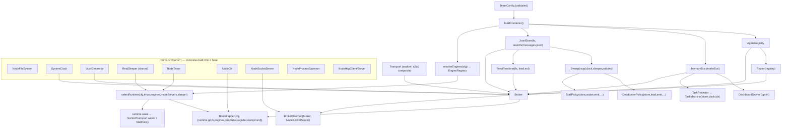

# 1. Composition root — what `compose.ts` wires

**Entry:** `buildContainer(cfg, templates)` in `src/compose.ts`.
It constructs every concrete adapter and assembles the broker + runtime graph,
returning `{ broker, daemon, bootstrapper, runtime, transport, messenger,
dashboard, taskMachine, bus, sweep }`. `team up` uses `daemon`, `bootstrapper`,
`dashboard`, `sweep`.

## Dependency graph



## Construction order (and WHY it is exactly this order)

From `buildContainer` top to bottom (`src/compose.ts`):

1. **Leaf ports:** `fs, registry, engines, clock, ids, sleeper`. One shared
   `RealSleeper` is reused by the sweep loop, the fleet scheduler, and the panes
   runtime's submit delay.
2. **`store`** = `JsonlStore(fs, join(teamDir, "messages.jsonl"))` where
   `teamDir = dirname(cfg.broker.socket)` — all artifacts live beside the socket.
3. **`bus`** = `makeBus(cfg.bus.kind)` (only `memory` ships). Always built so task
   projection + sweep work even with the dashboard off.
4. **Runtime kind detection:** `effectiveRuntime(a,cfg)` per agent →
   `needsPanes`/`needsServers`. Guard: `delivery:direct` requires all-servers.
5. **`socketTransport`** is built BEFORE the broker, but the broker's runtime is
   built AFTER the broker — circular need. Resolved with a **lazy waker**:
   `new SocketTransport({ wake:(id,s)=>runtime.wake(id,s) })` closes over the
   `runtime` variable assigned later (`let runtime: Runtime`).
6. **Servers wiring** (only if `needsServers`): bearer auth (`BrokerAuthProvider`
   + `InProcessSecret`), one token per agent, `FleetScheduler`, `A2ATransport`.
7. **`transport`** picks `composite` (mixed) | `a2a` (all servers) | `socket`.
8. **`broker`** = `makeBroker(transport)`.
9. **Task projection:** `TaskMachine(store,clock,ids)` + `TaskProjector`;
   `bus.subscribe(m => projector.handle(m))`; `taskMachine.rebuild()`.
10. **Sweep:** `emit = m => broker.emitInternal(m)` — flag/escalation events now
    flow through the SAME delivery path as a normal send (record → log + feed +
    inbox + publish, then best-effort wake), not a bare `store.append + publish`.
    `lead = cfg.agents[0].id`; `SweepLoop` with `StallPolicy` + `DeadLetterPolicy`.
11. **`runtime`** = `selectRuntime(...)` — assigns the `let runtime` the waker
    closed over, so the socket waker now resolves.
12. **`messenger`** (only `delivery:direct`): `DirectMessenger` for peer-to-peer.
13. **`daemon`** = `BrokerDaemon(broker, NodeSocketServer)`; **`bootstrapper`** =
    `Bootstrapper(cfg, {...})`. The bootstrapper threads `projectRoot =
    dirname(teamDir)` into every `runtime.spawn` (see `SpawnCtx.projectRoot`), so
    panes/servers launch the engine at the project root, not `shared/<id>`.
14. **`dashboard`** (opt-in): `DashboardServer` subscribed to the bus.

**Shared validation.** `src/a2a/http/rpc-validate.ts` holds the single JSON-RPC
shape validator reused by the A2A HTTP server for both `message/send` and
`message/stream` (no duplicated per-method parsing). **Shared `RealSleeper`** is
threaded into the sweep loop, the fleet scheduler, AND the panes runtime.

## Pseudocode skeleton (Python)

```python
def build_container(cfg, templates):
    fs, registry, clock, ids = NodeFs(), AgentRegistry(), SystemClock(), Uuid()
    sleeper = RealSleeper()
    team_dir = dirname(cfg.broker.socket)
    store = JsonlStore(fs, join(team_dir, "messages.jsonl"))
    bus = MemoryBus()
    engines = resolve_engines(cfg)

    kinds = {effective_runtime(a, cfg) for a in cfg.agents}
    needs_panes, needs_servers = "panes" in kinds, "servers" in kinds
    if cfg.delivery == "direct" and needs_panes:
        raise Error("direct requires all-servers")

    runtime_ref = Ref()                       # filled in step 11
    socket_t = SocketTransport(wake=lambda i, s: runtime_ref.value.wake(i, s))
    transport = pick_transport(needs_panes, needs_servers, socket_t, ...)

    broker = Broker(store, registry, Router(registry),
                    FeedRenderer(fs, join(team_dir, "feed.md")),
                    transport, clock, ids, publisher=bus)

    tm = TaskMachine(store, clock, ids)
    bus.subscribe(TaskProjector(tm).handle)
    tm.rebuild()

    emit = lambda m: broker.emit_internal(m)   # same path as send: record + best-effort wake
    sweep = SweepLoop(clock, sleeper, cfg.timers.sweep_interval_ms, policies=[
        StallPolicy(store, cfg.timers.stall_ms, waker=runtime_ref, emit=emit, ids=ids),
        DeadLetterPolicy(store, cfg.timers.dead_letter_ms, lead=cfg.agents[0].id, emit=emit, ids=ids),
    ])

    runtime_ref.value = select_runtime(cfg, NodeTmux(), engines, make_servers, sleeper)
    daemon = BrokerDaemon(broker, NodeSocketServer())
    boot = Bootstrapper(cfg, runtime=runtime_ref.value, git=NodeGit(), fs=fs,
                        engines=engines, templates=templates, register=broker.register)
    return Container(broker, daemon, boot, runtime_ref.value, transport, bus, sweep)
```

The **lazy waker** (the `Ref`) is the one non-obvious trick: the broker delivers
to panes by calling `runtime.wake`, but the runtime needs the broker (servers
mode) — so the transport closes over a mutable reference assigned last.
