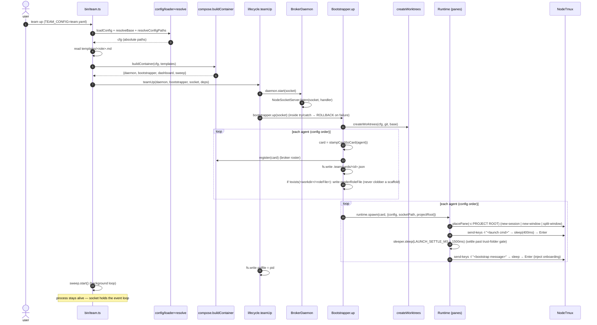
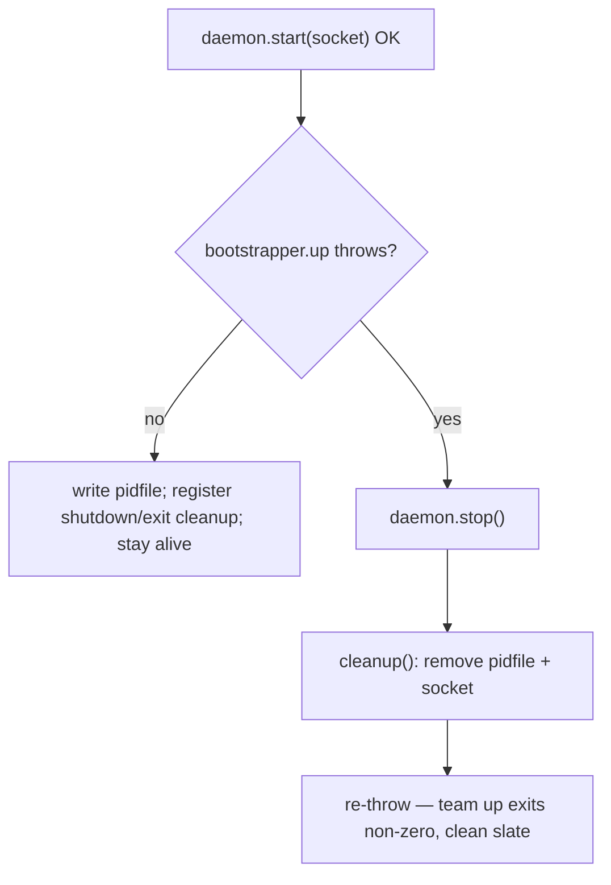
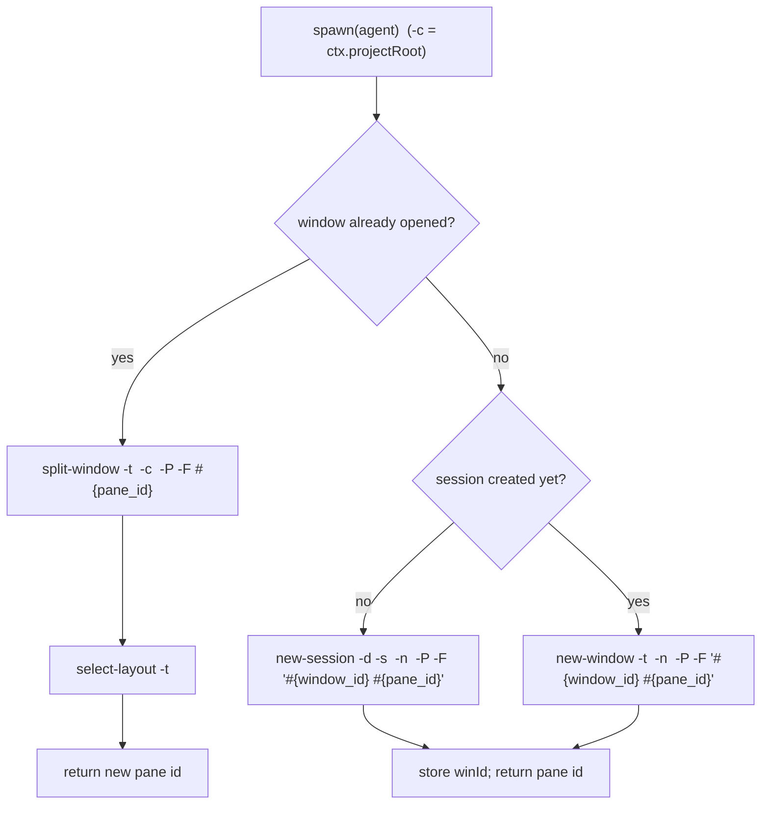

# 2. `team up` — bootstrap + launch sequence

**Entry:** `bin/team.ts` (`process.argv[2] === "up"`). Drives
`teamUp(daemon, bootstrapper, socket, deps)` in `src/client/lifecycle.ts`, which
calls `Bootstrapper.up` in `src/bootstrap/bootstrapper.ts`.

## Sequence

## ROLLBACK on bootstrap failure (`lifecycle.teamUp`)

`teamUp` wraps `bootstrapper.up` in a try/catch. The daemon is already listening
by then, so a partial bring-up (e.g. a spawn throws) must not leave a live daemon
and a bound socket to poison the next `team up`:

## Step detail (file:function)

- **Config load** — `bin/team.ts`: `loadConfig(configPath)` (`config/loader.ts`,
  Zod parse via `TeamConfigSchema`), `resolveBase(cfg, configPath)` and
  `resolveConfigPaths(cfg, base)` (`config/resolve.ts`) make socket/workdirs/
  worktree paths absolute against the **project base** (run-from-anywhere).
- **Templates** — for each distinct `agent.template ?? agent.role`, read
  `templates/<name>.md` if present (role-file body source).
- **`daemon.start`** — `BrokerDaemon.start` (`broker/daemon.ts`) →
  `NodeSocketServer.listen(socketPath, handler)`. `EADDRINUSE`/bind collision →
  `BrokerAlreadyRunningError` (the "already running" guard).
- **`createWorktrees`** — `bootstrap/worktrees.ts`: for each agent declaring a
  `worktree`, runs `git worktree add <path> <branch>` inside the base repo.
  Early-returns (no git calls) when no agent declares a worktree.
- **Card + role file** — `bootstrap/roles.ts`:
  - `toCard(agent)` → the published `AgentCard`.
  - `roleFileName(agent, engines)` → engine's `roleFile` (CLAUDE.md/AGENTS.md/…).
  - `renderRoleFile(template, agent)` → substitutes `{{id}}`, `{{role}}`, etc.
  - Two agents sharing the same workdir+engine collide on one role file → warn,
    last write wins (panes teams use `workdir: shared/<id>` to avoid this).
  - **Never-clobber:** the role file is written ONLY if it doesn't already exist,
    so `team up` after `team new` preserves the scaffold's rich per-agent guidance.
- **`register(card)`** — `Broker.register` populates `AgentRegistry` so
  `team ps`/`team send` can resolve the roster (panes engines never self-register).
- **`runtime.spawn`** — `PanesRuntime.spawn` (next diagram detail) or
  `ServersRuntime.spawn`, given `ctx = {config, socketPath, projectRoot}`. Launch
  command: `TEAM_AGENT_ID=<id> TEAM_SOCKET=<socket> <env> <command> <args>` (env
  values + args shell-quoted; the command is a trusted binary name).
  - **Launched at PROJECT ROOT.** The pane/process `cwd` is `ctx.projectRoot`
    (`dirname(teamDir)`), NOT `shared/<id>` — the agent operates on the whole
    project. The role file still lives under `shared/<id>` and is named in the
    bootstrap message (absolute path), since cwd no longer auto-reads it.
  - **Launch-settle + bootstrap message** (panes): after typing the launch
    command, sleep `LAUNCH_SETTLE_MS` (1500ms) so the engine reaches its main
    prompt past any "trust this folder?" gate, then type ONE deterministic
    onboarding line (`bootstrapMessage`): names the agent, points at its role file,
    embeds the exact `team inbox`/`team send` commands, and pins work to the root.
- **Stay alive** — `teamUp` writes the pidfile and returns WITHOUT exiting; the
  socket server keeps the event loop open so later `team send`/`team inbox` reach
  the broker. `team down` signals the pid from the pidfile.

## `PanesRuntime.placePane` (tmux topology)

`windowName = agent.window ?? agent.id`. Agents sharing a `window` value become
panes in one window (split + re-layout); pane order follows agent order. Pane ids
are captured (`#{pane_id}`) and stored so `wake` targets the stable id even after
tmux automatic-rename. Source: `src/runtime/panes.ts` (`spawn`, `placePane`,
`typeAndSubmit`).

## Teardown

`team down` → `teamDown` (`lifecycle.ts`): read pid from pidfile, `proc.kill(pid,
SIGTERM)`, remove pidfile + socket. The signalled process's shutdown handler runs
`bootstrapper.down()` → `runtime.teardown()` (`kill-session <team>`), then
`daemon.stop()`, then cleanup.
