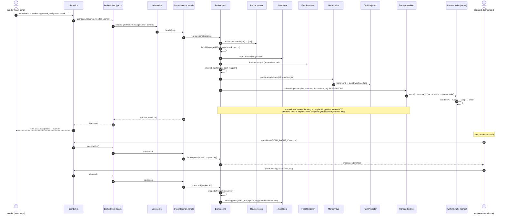
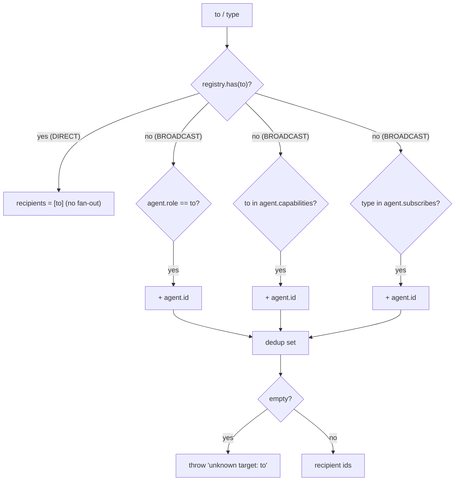
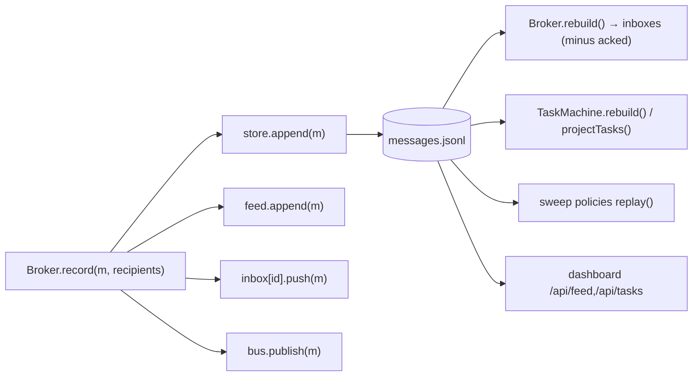

# 3. A message's life — send → deliver → peek → ack

This is the core data path. Trace it live with `TEAM_TRACE=1` — the `[cli]`,
`[rpc]`, `[daemon]`, `[router]`, `[broker]`, `[store]`, `[bus]`, `[panes]` lines
below are the actual seams.

## Full sequence (broker-mediated, panes runtime)



## Routing rules — `Router.resolve(to, type)` (`src/broker/router.ts`)

Resolution has **two mutually-exclusive modes**, decided first by `registry.has(to)`:

- **DIRECT** — `to` is an exact registered **agent id** → recipients = `[to]` ONLY.
  No type-subscriber fan-out: `--to <spoke>` is a *private* message, so a direct
  send never also wakes the hub.
- **BROADCAST** — `to` is NOT a known id (a **role**, a **capability**, or any
  token) → fan out the **union** of: agents whose `role == to`, agents whose
  `capabilities` include `to`, and agents who `subscribe` to the message **type**.



> **Hub-and-spoke consequence:** `team new` makes the orchestrator (`agents[0]`)
> subscribe to ALL types and everyone else to none. In BROADCAST mode (a role /
> capability / type-only target) the hub is always added via the subscription
> rule; but a DIRECT `--to <id>` reaches that id ALONE (no hub copy).

## Persistence + projections — the log is the single source of truth



- **`record`** (`Broker.record`, private) is the ONLY method that appends a normal
  message, feeds it, fills inboxes, and publishes — `send`, `observe`, AND
  `emitInternal` all funnel through it.
- **Delivery vs recording are separate.** `record` fills the in-memory inbox and
  the log (so `peek` works); `deliverAll` then *wakes* each recipient per-recipient
  and **best-effort** (a `transport.deliver` that throws is caught and logged, not
  re-raised). The inbox is the source of truth, so a missed wake never loses the
  message — a pane agent still pulls it via `team inbox`.
- **`emitInternal`** (`Broker.emitInternal`) is how sweep policies (stall /
  dead-letter) inject a flag/escalation through the SAME path as a real send:
  `safeResolve(to,type)` → `record` (log + feed + inbox + publish) → `deliverAll`
  (best-effort wake). So a `stall_flag`/`escalation` shows up in `team inbox` +
  `feed.md`, not just the durable log.
- **peek/ack watermark** (`Broker.peek` / `Broker.ack`): `peek` is
  non-destructive; `ack` drops ids from the inbox AND appends an `inbox_ack`
  record. `rebuild()` replays the log and skips acked ids, so a crash between
  read and processing never loses mail (at-least-once; consumers idempotent).

## Direct (peer-to-peer) variant

When `cfg.delivery === "direct"` (all-servers only), the **sender** delivers
peer-to-peer over A2A via `DirectMessenger` (`src/a2a/direct.ts`). The order is
**observe-FIRST, then deliver**:

1. Build the `Message` (single id/ts).
2. `observer.observe(m)` → `Broker.observe` calls `record(m, resolve(...))` so the
   durable log + feed + inbox state are complete BEFORE any peer delivery — a
   partial per-recipient failure can never hide the message from the log.
3. For each resolved recipient, `endpoints.clientFor(card).sendMessage(m)`
   peer-to-peer, **best-effort**: an unreachable peer is caught and logged, never
   aborting delivery to the others (the log is the source of truth).

The broker is NOT in the delivery path — it is purely the observer. Same log,
same projections; identical to broker-mediated send for every downstream reader.

## Message shape (replicate exactly)

```
Message = {
  id: "m_<uuid>",          # IdGenerator.next("m")
  from: str, to: str,       # to may be id|role|capability
  type: str,                # task_assignment | status | review_request | ...
  task?: str,               # optional task id this message concerns
  parts: [Part],            # {kind:"text",text} | {kind:"data",data} | {kind:"file",path}
  ts: ISO8601,              # Clock.isoNow()
}
```
