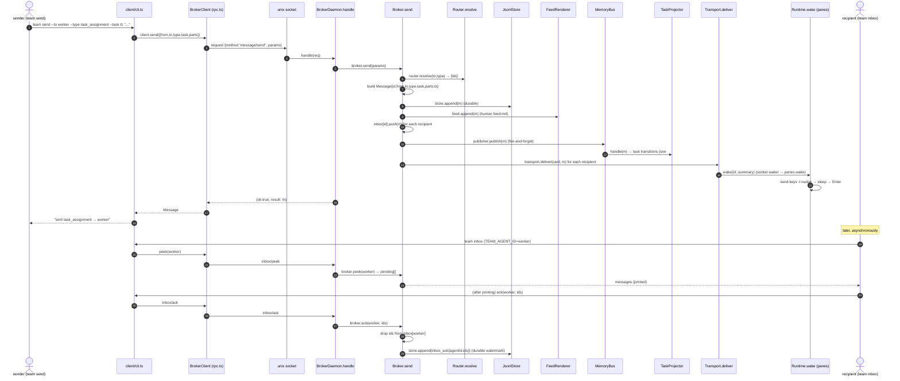
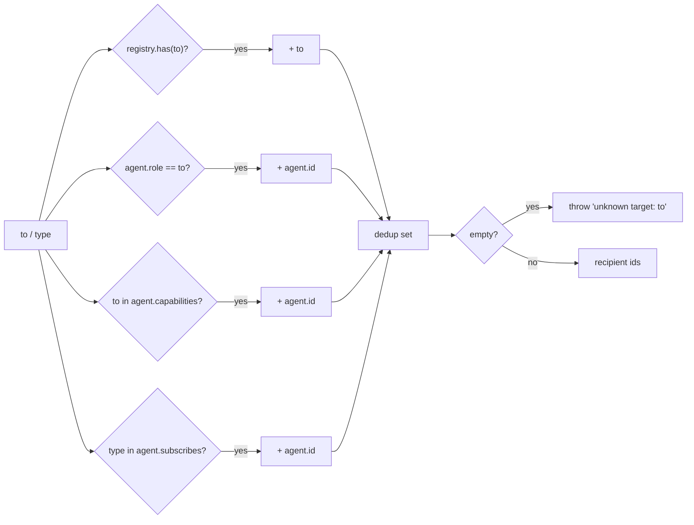
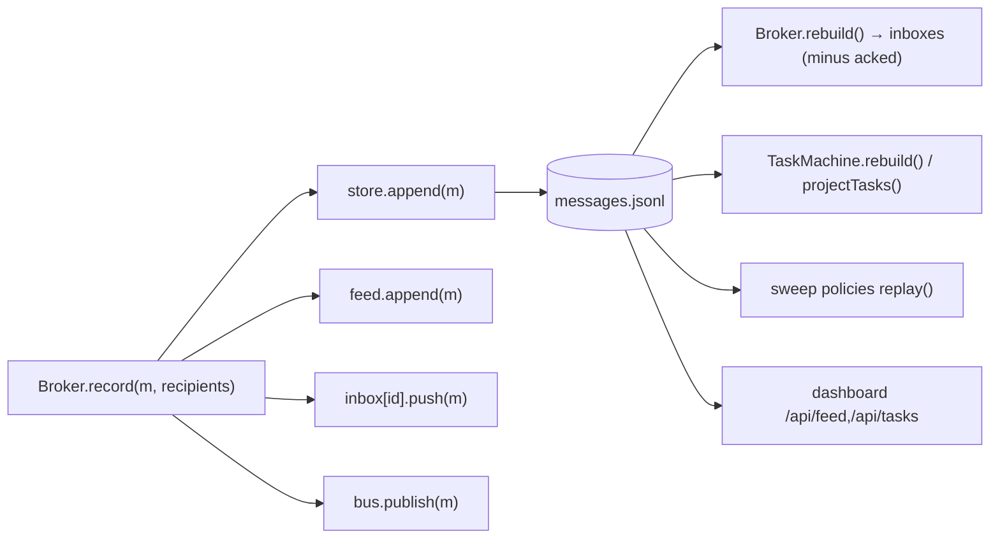

# 3. A message's life — send → deliver → peek → ack

This is the core data path. Trace it live with `TEAM_TRACE=1` — the `[cli]`,
`[rpc]`, `[daemon]`, `[router]`, `[broker]`, `[store]`, `[bus]`, `[panes]` lines
below are the actual seams.

## Full sequence (broker-mediated, panes runtime)



## Routing rules — `Router.resolve(to, type)` (`src/broker/router.ts`)

A `to` value can be an **id**, a **role**, or a **capability**; subscribers of the
message **type** are always added. The recipient set is the **union**:



> **Hub-and-spoke consequence:** `team new` makes the orchestrator (`agents[0]`)
> subscribe to ALL types and everyone else to none. So a message addressed to
> anyone *also* reaches the orchestrator via the subscription rule — which is why
> in the live trace `--to worker` resolved to `[worker, lead]`.

## Persistence + projections — the log is the single source of truth



- **`record`** (`Broker.record`, private) is the ONLY method that appends a normal
  message, feeds it, fills inboxes, and publishes — both `send` and `observe`
  funnel through it.
- **Delivery vs recording are separate.** `record` fills the in-memory inbox and
  the log (so `peek` works); `transport.deliver` *wakes* the recipient (types a
  nudge / pushes a webhook). A pane agent then runs `team inbox` to pull.
- **peek/ack watermark** (`Broker.peek` / `Broker.ack`): `peek` is
  non-destructive; `ack` drops ids from the inbox AND appends an `inbox_ack`
  record. `rebuild()` replays the log and skips acked ids, so a crash between
  read and processing never loses mail (at-least-once; consumers idempotent).

## Direct (peer-to-peer) variant

When `cfg.delivery === "direct"` (all-servers only), the **sender** delivers
peer-to-peer over A2A via `DirectMessenger` (`src/a2a/direct.ts`) and the broker
is only an **observer**: `Broker.observe(m)` calls `record(m, resolve(...))` to
keep the log/feed/inbox complete but does NOT call `transport.deliver`. Same log,
same projections; the broker is just off the delivery path.

## Message shape (replicate exactly)

```
Message = {
  id: "m_<uuid>",          # IdGenerator.next("m")
  from: str, to: str,       # to may be id|role|capability
  type: str,                # task_assignment | status | review_request | ...
  task?: str,               # optional task id this message concerns
  parts: [Part],            # {kind:"text",text} | {kind:"data",data} | {kind:"file",path}
  ts: ISO8601,              # Clock.isoNow()
}
```
