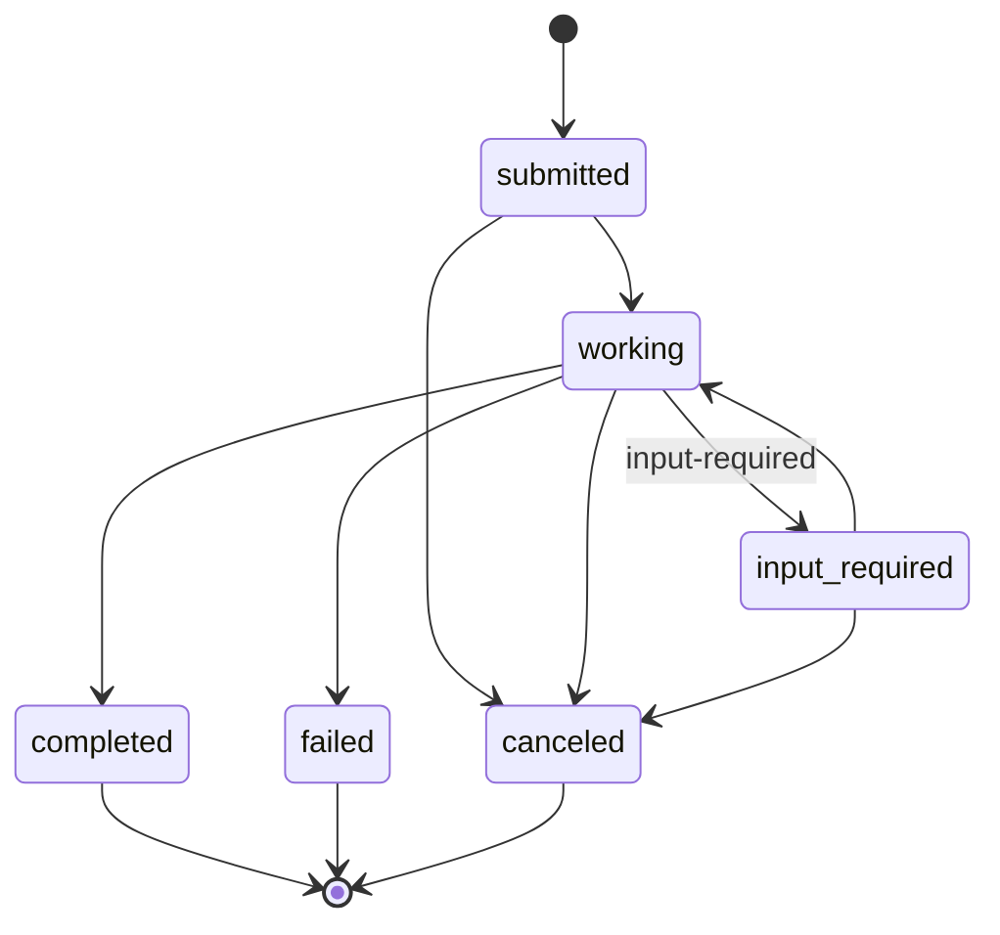

# 4. Task projection — deriving task state from traffic

Tasks are never mutated directly by senders. The **TaskProjector** observes
recorded messages off the bus and drives the **TaskMachine**, which persists each
transition as a `task_status` message. Task state is therefore a **projection of
the log** — `rebuild()` reconstructs it exactly.

Source: `src/broker/task-projector.ts`, `src/broker/tasks.ts`.

## How a message becomes a task transition

```mermaid
sequenceDiagram
  autonumber
  participant BUS as MemoryBus.publish(m)
  participant TP as TaskProjector.handle(m)
  participant TM as TaskMachine
  participant ST as JsonlStore

  BUS->>TP: handle(m)
  TP->>TP: if not m.task → return
  TP->>TP: state = TYPE_TO_STATE[m.type]; if none → return
  TP->>TP: owner = resolveOwner(m.to, m.type)[0] ?? m.to  (resolve→concrete agent id)
  TP->>TM: ensure(m.task, {title, owner})
  alt task absent
    TM->>TM: create in "submitted"
    TM->>ST: append task_status{submitted}
  end
  TP->>TM: transition(m.task, state)
  alt legal & not same state
    TM->>ST: append task_status{state}
  else illegal/late
    TM-->>TP: throw → caught & ignored (bus is at-least-once, unordered)
  end
```

### `TYPE_TO_STATE` (the only types that move a task)

| message type | → task state |
|---|---|
| `task_assignment` | `working` |
| `review_request` | `working` |
| `approval` | `completed` |
| `ruling` | `completed` |
| `escalation` | `input-required` |

Any other type (including the projector's own `task_status` output) is ignored —
no feedback loop. A message with no `task` id is ignored.

### Owner = a concrete agent id, not a route token

A `task_assignment` may be addressed to a **role** or **capability** (`m.to`), not
a real agent. The projector is constructed with a `resolveOwner(to, type)`
function (the broker's `router.resolve`) and sets `owner = resolveOwner(...)[0] ??
m.to` — so the task is owned by a concrete agent id the stall sweep can actually
`wake`. Resolution is guarded by try/catch and falls back to `m.to` when it is
empty or throws (e.g. an unknown target).

## Task state machine — `LEGAL_TRANSITIONS` (`tasks.ts`)



Rules in `TaskMachine.transition(taskId, to)`:
- Unknown task id → throw.
- `to === current` → **no-op** (idempotent; tolerates duplicate/late delivery).
- `to` not in `LEGAL_TRANSITIONS[current]` → throw (terminal states allow none).
- Else set state and `record({taskId, state})` as a `task_status` message.

`ensure(id, {title, owner})` creates the task in `submitted` if absent (else
returns existing) so the projector can act on a task it has never seen.

## Rebuild-from-log — `projectTasks` / `TaskMachine.rebuild`

`projectTasks(messages)` folds the log: each `task_status` event sets a task's
latest `state` (title/owner carried forward). `rebuild()` clears the in-memory
map and replays. This is also what the read-only dashboard's `/api/tasks` uses.

```python
def project_tasks(messages):
    tasks = {}
    for m in messages:
        if m.type != "task_status" or not m.task: continue
        ev = data_part(m)                      # {taskId,state,title?,owner?}
        prev = tasks.get(ev.taskId)
        tasks[ev.taskId] = Task(id=ev.taskId,
                                title=ev.title or (prev.title if prev else ""),
                                owner=ev.owner or (prev.owner if prev else ""),
                                state=ev.state)
    return list(tasks.values())
```

## Why "observer, never on the delivery path"

`TaskProjector` only reads the bus and writes `task_status` events back to the
log. It never delivers messages, never blocks `send`. If the bus delivers a
duplicate or out-of-order message, the idempotent no-op + the try/catch around
`transition` keep it correct — exactly the contract a future network bus
(`MessagePublisher`) is allowed to rely on.
