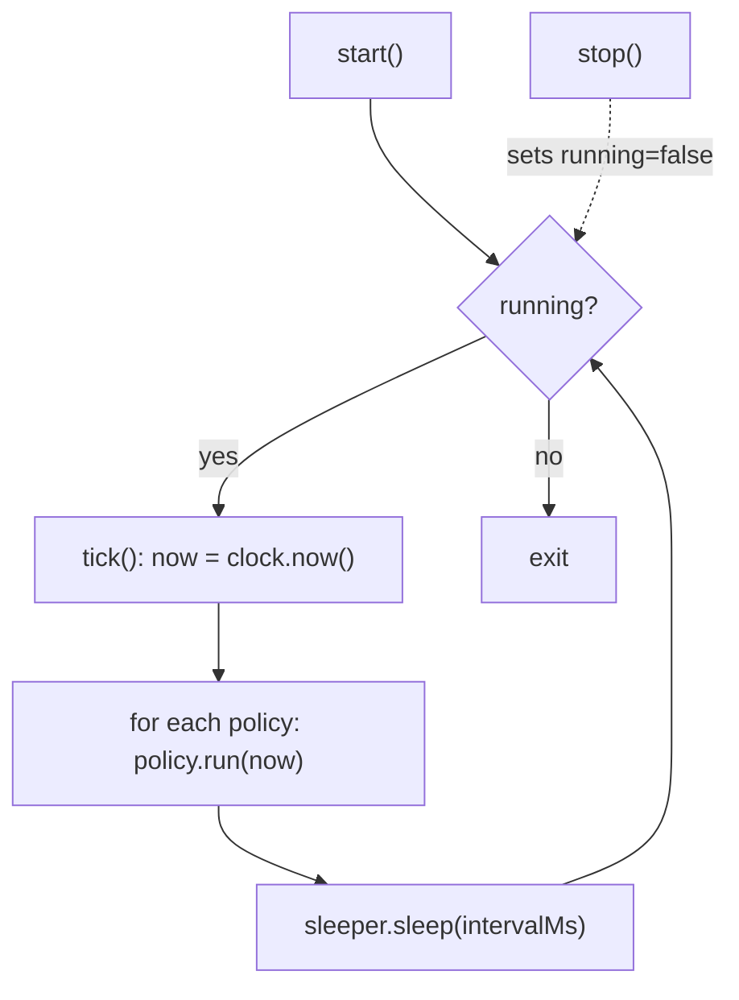
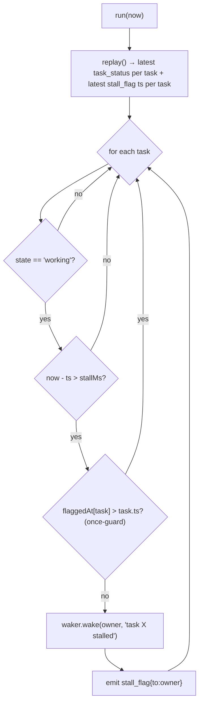
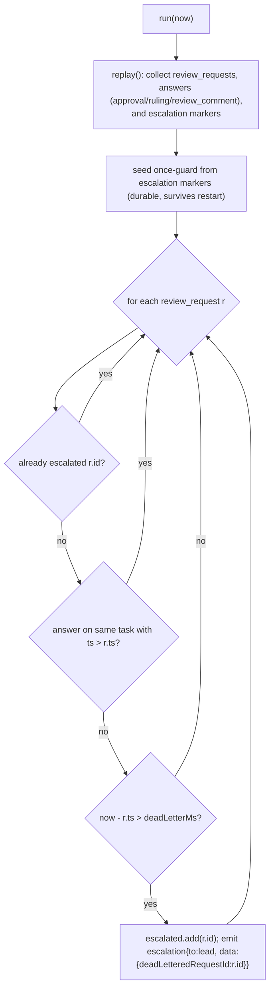

# 5. Liveness sweep — stall + dead-letter

A single **clock/sleeper-driven loop** evaluates a list of **policies** on a fixed
cadence. Policies read the log and emit durable+published flag/escalation events.
Extend the sweep by adding a `SweepPolicy` implementation — never by editing the
loop.

Source: `src/broker/sweep.ts`, `src/broker/policies/stall.ts`,
`src/broker/policies/dead-letter.ts`. Wired in `compose.ts` (the `sweep` it
returns); started in `bin/team.ts` after `teamUp` (`void sweep.start()`).

## The loop — `SweepLoop` (`sweep.ts`)



`tick()` is public so tests advance a **fake clock** and call `tick()` directly —
no real timers. `intervalMs = cfg.timers.sweepIntervalMs` (default 30s).

## Policy interface

```ts
interface SweepPolicy { run(now: Date): void }
```

Both policies are constructed with `emit = (m) => broker.emitInternal(m)` (from
`compose.ts`). `emitInternal` routes the flag/escalation through the broker's
normal path — `record` (log + feed + inbox + publish) then best-effort `wake` — so
every flag/escalation is durable, observable, AND lands in the recipient's
`team inbox` + `feed.md`, not just the raw log.

## StallPolicy — re-nudge stuck tasks (`policies/stall.ts`)



- Builds the latest state/owner/ts per task by folding `task_status` events, AND
  the latest `stall_flag` ts per task (the durable once-guard).
- A task **latest in `working`** longer than `stallMs` (default 10 min), and NOT
  already flagged for this window → `runtime.wake(owner, …)` (the same waker the
  broker uses) AND a durable `stall_flag`.
- **Once per window:** a `stall_flag` emitted *after* the task's latest
  `task_status` (`flaggedAt[task] > t.ts`) means this stall window is already
  flagged → skip (no re-nudge every tick). The guard is durable — it survives
  restart because it is rebuilt from `stall_flag` events in the log.
- Self-resetting: any newer `task_status` (e.g. progress) moves `t.ts` forward,
  so the window restarts and a later re-flag is allowed.

## DeadLetterPolicy — escalate unanswered review requests (`policies/dead-letter.ts`)



- **Answer = same `task` AND `ts > request.ts`.** A pre-existing answer or a newer
  *unanswered* request is evaluated per request (no false suppression).
- **Escalate exactly once.** The once-guard is **durable**: each escalation
  carries `{deadLetteredRequestId}` in a data part; `run()` re-seeds `escalated`
  from those markers on every pass, so a restart/rebuild never re-escalates.
- `lead = cfg.agents[0].id` (the orchestrator convention).
- `deadLetterMs` default 30 min.

## Replicate (Python)

```python
class SweepLoop:
    def __init__(self, clock, sleeper, interval_ms, policies):
        self.clock, self.sleeper, self.interval_ms, self.policies = ...
        self.running = False
    def tick(self):
        now = self.clock.now()
        for p in self.policies: p.run(now)
    async def start(self):
        self.running = True
        while self.running:
            self.tick()
            await self.sleeper.sleep(self.interval_ms)
    def stop(self): self.running = False

class DeadLetterPolicy:
    def __init__(self, store, dead_letter_ms, lead, emit, ids):
        self.escalated = set()  # durable guard, re-seeded each run
        ...
    def run(self, now):
        reqs, answers = [], []
        for m in self.store.replay():
            if m.type == "review_request" and m.task: reqs.append(m)
            elif m.task and m.type in {"approval","ruling","review_comment"}: answers.append(m)
            elif m.type == "escalation":
                mk = data_part(m)
                if mk and mk.get("deadLetteredRequestId"): self.escalated.add(mk["deadLetteredRequestId"])
        for r in reqs:
            if r.id in self.escalated: continue
            if any(a.task == r.task and parse(a.ts) > parse(r.ts) for a in answers): continue
            if now.ms - parse(r.ts) <= self.dead_letter_ms: continue
            self.escalated.add(r.id)
            self.emit(escalation(to=self.lead, task=r.task,
                                 data={"deadLetteredRequestId": r.id}))
```
