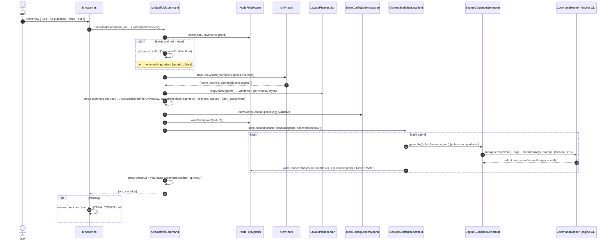

# 6. `team new` — scaffold a working team into the cwd

`team new` is the one-step "go from empty folder to a runnable team": it runs an
interactive wizard, plans tmux windows, writes a validated `team.yaml`, and writes
one **context file per agent** (LLM-drafted role guidance + a deterministic
"How to communicate" footer). Composed by `runScaffoldCommand` in `compose.ts`
out of single-responsibility units, each behind an injected port.

Entry: `bin/team.ts` (`process.argv[2] === "new"`) → `runScaffoldCommand(opts, deps)`.

## Sequence



## Units (each its own file, injected)

| Unit | File | Responsibility |
|---|---|---|
| `runWizard` | `cli/wizard.ts` | asks name, runtime (panes/servers), team shape (presets / pairs / custom), engine per agent → `{name, runtime, agents}` |
| `LayoutPlanner` | `cli/layout-planner.ts` | window per agent (default = id); for windows with ≥2 agents, a tmux layout |
| `ContextScaffolder` | `cli/context-scaffolder.ts` | writes one role file per agent; 200-line cap on guidance; never overwrites |
| `buildWiringFooter` | `cli/context-scaffolder.ts` | deterministic "How to communicate" block (commands, message types, hub/spoke topology, examples) |
| `EngineGuidanceGenerator` | `cli/guidance-engine.ts` | spawns the generator engine headlessly to draft role guidance; returns `null` on any failure |
| `Prompter` | `ports/prompter.ts` | `ask/select/confirm`; `NodePrompter` (stdin) or `ScriptedPrompter` (headless/tests) |
| `CommandRunner` | `ports/command.ts` | one-shot capture-stdout-with-timeout runner |

## Key invariants (replicate exactly)

- **Engine-agnostic generation.** `headlessArgs` on an `EngineProfile` declares how
  to run that engine as a one-shot prompt: argv = `[...args, ...headlessArgs,
  prompt]`. Absent ⇒ generator returns `null` ⇒ wiring-only fallback. Built-ins:
  claude `["-p"]`, codex `["exec"]`, cursor-agent `["-p"]`.
- **Generator selection.** `cfg.scaffold.generator` (default `claude`, validated
  against the engine set). `--no-guidance` swaps in a NULL generator (no spawn).
- **Per-agent workdir + run at root.** Every agent's *role file* lives at
  `workdir: shared/<id>` (so two agents on the same engine don't collide on one
  `CLAUDE.md`), but the engine is **launched at the project root** (`root: "."`,
  `SpawnCtx.projectRoot`) so it operates on the whole project, not its near-empty
  `shared/<id>` dir.
- **Hub-and-spoke subscriptions.** `agents[0]` (orchestrator) subscribes to ALL
  `DEFAULT_MESSAGE_TYPES`; every other (spoke) agent subscribes to
  `["task_assignment"]` — so a broadcast `task_assignment` reaches every spoke,
  while replies/status flow back through the hub. Direct `--to <id>` always works.
- **Overwrite guard.** Existing `out` + no `--force` → prompt (default no) and
  abort; `--yes` keeps the existing file (short-circuited in `bin/team.ts`);
  `--force` overwrites.
- **200-line cap.** `ContextScaffolder` trims guidance so
  `guidance + blank + footer ≤ 200` lines; the footer is always preserved intact.
- **Never overwrite a context file.** If the target role file already exists →
  skip + warn.

## Context file anatomy

```
<LLM role guidance, trimmed to fit the 200-line budget>

## How to communicate
- identity (id, role, team), teammates, subscriptions
- topology: hub-and-spoke through <orchestrator>
- commands: team inbox <id> ; team send --to <id> --type <type> --text "..."
- message-type vocabulary (task_assignment, status, review_request, ...)
- 2 role-fit examples (hub: assign/ruling ; spoke: status/escalation)
```

`buildWiringFooter(team, self, all)` is pure (deterministic from config); the
orchestrator is `all[0]`. This is the same footer the live `[scaffolder]` trace
writes.
