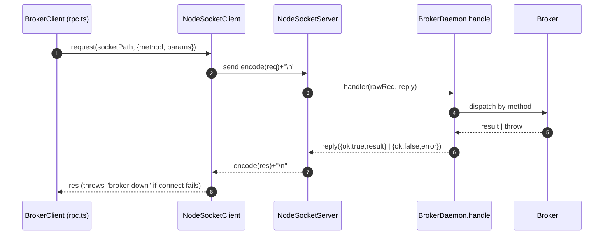
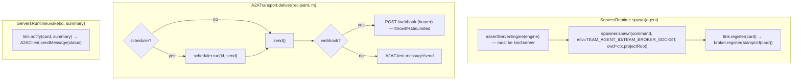

# 7. Servers/A2A runtime + daemon socket protocol + client RPC

Two transport worlds meet here:

1. **Client ↔ broker** over a **unix-domain socket** with a tiny line-delimited
   JSON RPC (`team send`/`inbox`/`ps`, and cross-process `observe`).
2. **Broker ↔ server-agent** over **A2A HTTP** (servers runtime): deliver = push
   to the agent's webhook (or `message/send`); wake = same push.

## A. Daemon socket protocol

Source: `src/broker/protocol.ts`, `src/broker/daemon.ts`, `src/ports/transport.ts`,
`src/client/rpc.ts`.

### Wire format

- **Framing:** newline-delimited JSON. `encode(v) = JSON.stringify(v)+"\n"`;
  `decodeLines(buffer)` yields one object per non-empty line.
- **Request** (`protocol.ts`): `{method, params}` where method ∈
  `agent/register | agent/list | message/send | message/observe | inbox/peek |
  inbox/ack`.
- **Response:** `{ok:true, result}` or `{ok:false, error}`.

### Dispatch table — `BrokerDaemon.handle` (`daemon.ts`)

| method | broker call | result |
|---|---|---|
| `agent/register` | `broker.register(card)` | `null` |
| `agent/list` | `broker.agents()` | `AgentCard[]` |
| `message/send` | `broker.send(params)` | `Message` |
| `message/observe` | `broker.observe(message)` | `null` |
| `inbox/peek` | `broker.peek(agentId)` | `Message[]` |
| `inbox/ack` | `broker.ack(agentId, ids)` | `null` |

`start(socket)` normalizes `EADDRINUSE`/bind collision → `BrokerAlreadyRunningError`
(the "broker already running" signal). Any thrown error in dispatch becomes
`{ok:false, error}`.

`BrokerClient` (`rpc.ts`) implements `MessageObserver` so a **separate-process**
agent posts its observer copy via `message/observe` over the same seam the
in-process broker satisfies.

### Hardening (`transport.ts` + `daemon.ts`)

- **Malformed socket frame** — `NodeSocketServer` parses each newline-framed line
  in a try/catch. A line that fails `JSON.parse` does NOT crash the data handler:
  the server writes `{ok:false, error:"malformed JSON frame"}` and keeps consuming
  the rest of the stream. A persistent `server.on("error")` handler is installed
  after bind so a later socket error logs rather than crashing the daemon.
- **Invalid request shape** — `BrokerDaemon.handle` rejects a request missing a
  string `method` with `{ok:false, error:"invalid request: missing method"}`
  before any dispatch.
- **Socket permissions** — the socket's parent dir is created (and a pre-existing
  one tightened) to **0700**, and the socket itself chmodded to **0600**
  (best-effort; platforms without chmod skip), so other local users can't
  connect to the broker.
- **Stale socket** — on bind, if the path exists: a live probe → throw
  `BrokerAlreadyRunningError`; a dead leftover → `unlink` then bind.

## B. Servers (A2A) runtime

Source: `src/runtime/servers/servers.ts`, `src/broker/a2a-transport.ts`,
`src/runtime/servers/scheduler.ts`, `src/a2a/http/*`, `src/compose.ts` (A2A wiring).

### A2A delivery vs panes delivery (same `Transport` seam)

| | panes | servers |
|---|---|---|
| host | tmux pane running engine CLI | `kind:server` process w/ HTTP endpoint |
| transport | `SocketTransport` (lazy waker → `panes.wake`) | `A2ATransport` |
| "wake" | `send-keys -l nudge` → sleep → Enter | webhook push / `message/send` |
| pull mail | agent runs `team inbox` (socket RPC) | agent's server reads via its A2A surface |
| auth | none (local tmux) | bearer token per agent (`BrokerAuthProvider`) |

### FleetScheduler — one shared rate-limit pool (`scheduler.ts`)

Every model-triggering A2A delivery goes through `scheduler.run(agentId, call)`:
1. **acquireSlot** — bounded concurrency (`maxConcurrency`); excess queues.
2. **consumeToken** — token bucket (`bucketCapacity`, `refillPerSec`); waits if dry.
3. **callWithBackoff** — on HTTP 429 (`isRateLimited`), honor `Retry-After` or
   exponential backoff up to `maxRetries`.

### A2A HTTP layer hardening (`src/a2a/http/*`)

- **Shared RPC validation** — `src/a2a/http/rpc-validate.ts` is the single
  JSON-RPC shape validator. Both `message/send` and `message/stream` route their
  request parsing through it (one place to reject a malformed RPC envelope), so
  the two handlers can't drift.
- **Server bind error** — the HTTP server's `listen` rejects on a bind error
  (e.g. port in use) instead of throwing unhandled, mirroring the socket daemon.
- **Handler throw → 500** — an exception inside an A2A request handler is caught
  and answered with HTTP 500 (the server process stays up).
- **Non-2xx → throw on the client** — the A2A HTTP client treats any non-2xx
  response as a failure and throws, so a delivery failure surfaces to the
  best-effort `deliverAll`/`DirectMessenger` catch rather than being silently
  swallowed.

### Discovery, URLs, TLS

- `staticDiscoveryFromConfig(cfg)` resolves each agent's reachable A2A base URL
  from config (`host`/`url`); `stampUrl(discovery, card)` stamps it onto the card
  ONCE so registration, the on-disk card, and spawn all use the identical URL.
- Opt-in TLS: `cfg.servers.tls` → clients trust the configured CA; servers listen
  with TLS; scheme becomes `https`. Absent → plain `http` (default).

### Mixed teams — `CompositeTransport` (`composite-transport.ts`)

When a team has both pane and server agents, the broker delivers through a
`CompositeTransport` keyed on the **recipient's** runtime: a pane recipient is
woken over the socket, a server recipient over A2A — both directions transparent.
`delivery:direct` is rejected unless EVERY agent is on servers (a pane has no A2A
endpoint to receive peer-to-peer).
