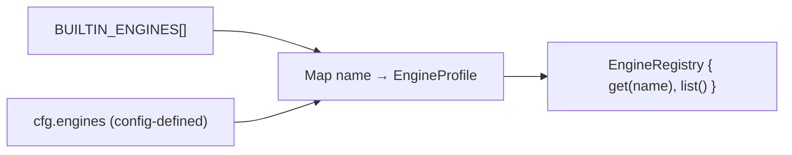
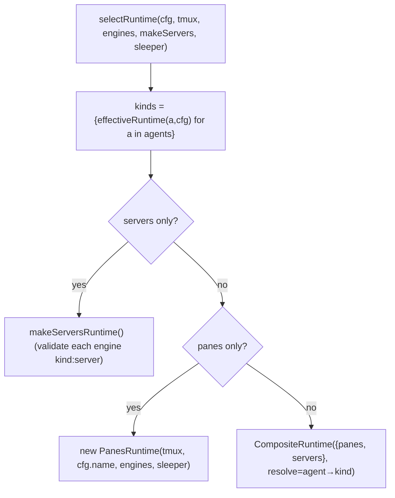

# 8. Engine registry + runtime selection

Two orthogonal choices define how an agent runs:

- **Engine** = *which CLI* the agent is (claude, codex, …). Resolved by the
  **engine registry**.
- **Runtime** = *how the agent is hosted* (tmux pane vs A2A server). Resolved by
  **`selectRuntime`**, behind the single `Runtime` seam.

## A. Engine registry — `resolveEngines(cfg)` (`src/engines/registry.ts`)



- Starts from `BUILTIN_ENGINES` then overlays `cfg.engines` (config can add or
  override). Config-defined profiles default `kind:"repl"`.
- **`EngineProfile`** (`src/engines/profile.ts`):
  ```
  { name, command, roleFile, kind?: "repl"|"server",
    args?: string[], env?: {}, headlessArgs?: string[] }
  ```
  - `command` — binary to launch (also the PATH probe in `team doctor`).
  - `roleFile` — the context filename this engine reads (CLAUDE.md / AGENTS.md /
    GEMINI.md / CONVENTIONS.md / custom).
  - `kind` — `repl` (interactive, panes) vs `server` (A2A, servers runtime).
  - `headlessArgs` — argv to run it as a one-shot prompt (guidance generation).

### Built-ins (verified)

| name | command | roleFile | kind | headlessArgs |
|---|---|---|---|---|
| claude | claude | CLAUDE.md | repl | `["-p"]` |
| codex | codex | AGENTS.md | repl | `["exec"]` |
| cursor-agent | cursor-agent | AGENTS.md | repl | `["-p"]` |
| opencode | opencode | AGENTS.md | repl | — |
| gemini | gemini | GEMINI.md | repl | — |
| aider | aider | CONVENTIONS.md | repl | — |

An agent's engine comes from `agent.engine ?? agent.cli ?? "claude"` (schema
transform); the top-level `superRefine` validates it against
`BUILTIN_ENGINES ∪ keys(cfg.engines)`.

## B. Runtime selection — `selectRuntime` (`src/runtime/select.ts`)



- **`effectiveRuntime(agent, cfg)`** = `agent.runtime ?? cfg.runtime`. A team can
  be all-panes, all-servers, or **mixed** per agent.
- **Server-eligibility** is validated only for agents actually hosted on servers
  (`assertServerEngine` — engine must be `kind:"server"`), so a mixed team's pane
  agents may keep repl engines.
- The `sleeper` threaded in is the shared `RealSleeper` (panes uses it for the
  type→Enter submit delay).

## C. The `Runtime` seam (`src/runtime/runtime.ts`)

```ts
interface Runtime {
  spawn(agent: AgentCard, ctx: {config, socketPath}): Promise<void>  // bring online
  wake(agentId: string, summary: string): Promise<void>             // "you have mail; pull inbox"
  teardown(): Promise<void>                                         // release everything spawn created
}
```

The broker and bootstrapper depend ONLY on this — nothing tmux/HTTP-specific
leaks past it. A new hosting strategy = a new `Runtime` impl selected in
`compose.ts`.

| impl | spawn | wake | teardown |
|---|---|---|---|
| `PanesRuntime` | open tmux pane + launch CLI | `send-keys` nudge → sleep → Enter | `kill-session` |
| `ServersRuntime` | spawn `kind:server` process + `link.register` | A2A webhook/notify push | `kill` each process |
| `CompositeRuntime` | delegate by `resolve(agent)`, remember kind | route to the same kind | teardown each distinct runtime once |

## D. CompositeRuntime routing (`src/runtime/composite.ts`)

```mermaid
sequenceDiagram
  participant BS as Bootstrapper
  participant CR as CompositeRuntime
  participant P as PanesRuntime
  participant SV as ServersRuntime
  BS->>CR: spawn(agentA = panes)
  CR->>P: spawn(agentA); remember kinds[A]=panes
  BS->>CR: spawn(agentB = servers)
  CR->>SV: spawn(agentB); remember kinds[B]=servers
  Note over CR: later, broker delivers to A → wake
  CR->>P: wake(A)   (by remembered kind)
```

`CompositeRuntime` mirrors `CompositeTransport` (diagram 7): the **runtime** routes
*hosting/wake* by the agent's kind; the **transport** routes *delivery* by the
recipient's kind. Both are keyed the same way, so a pane agent and a server agent
collaborate transparently.

## Replicate (Python)

```python
def select_runtime(cfg, tmux, engines, make_servers, sleeper):
    kinds = {effective_runtime(a, cfg) for a in cfg.agents}
    if kinds == {"servers"}: return make_servers()
    if kinds == {"panes"}:   return PanesRuntime(tmux, cfg.name, engines, sleeper)
    by_id = {a.id: effective_runtime(a, cfg) for a in cfg.agents}
    return CompositeRuntime({"panes": PanesRuntime(tmux, cfg.name, engines, sleeper),
                             "servers": make_servers()},
                            resolve=lambda agent: by_id.get(agent.id, cfg.runtime))
```
